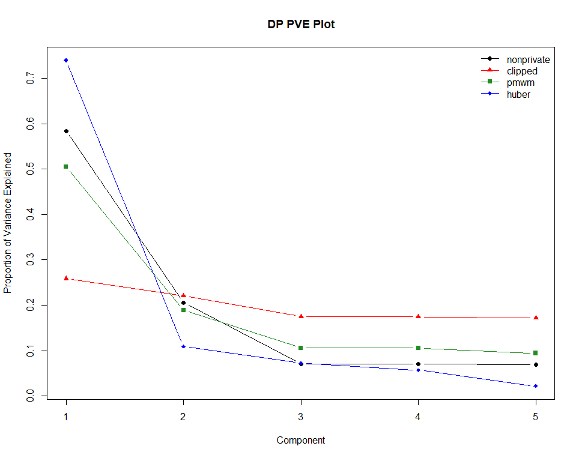
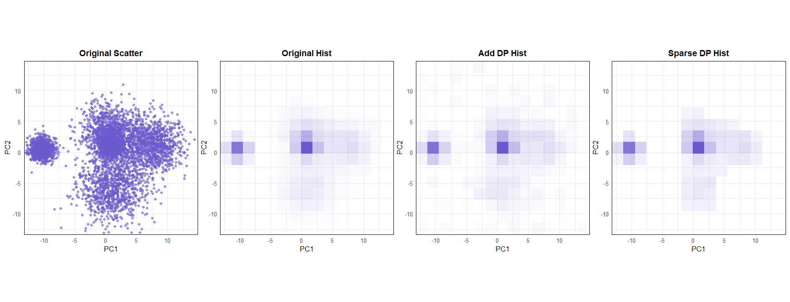
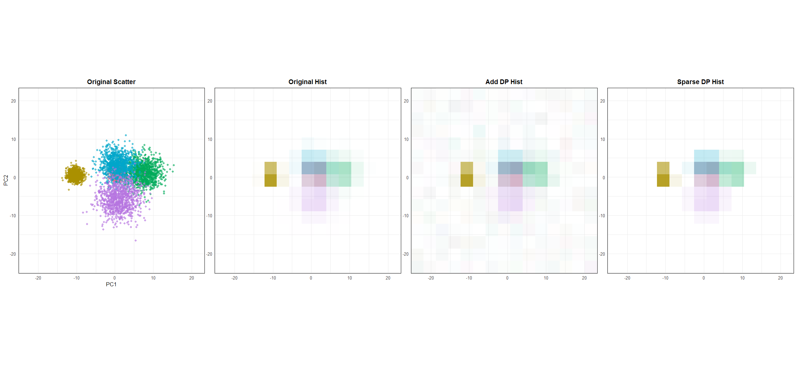

# dppca

<!-- badges: start -->
<!-- badges: end -->

`dppca` provides tools for **differentially private principal component analysis (PCA) visualization** in R. 
It supports private loading estimation and loading plots, private scree/PVE plots, private score plots, grouped score visualizations, and an interactive 'shiny' app.

## Installation

You can install the development version from GitHub with:

```r
# install.packages("devtools")
devtools::install_github("yejinjo0220/dppca")
```

## Basic workflow

The main workflow is:

1. estimate private loadings with `dp_loading()` and compare loadings with `dp_loading_plot()`.
2. estimate and plot private scree/PVE summaries with `dp_scree()` and `dp_scree_plot()`.
3. compute and plot private PCA score summaries with `dp_score()` and `dp_score_plot()`.
4. optionally use grouped score visualizations or the Shiny app.

The scree and score functions, including grouped versions, always estimate private loadings internally with `dp_loading()`. Each function accepts `X` directly and estimates its own loadings. Within one scree call, all requested methods share one loading estimate. Within one score call, the methods share both the loading estimate and the frame.

Use `dp_pca()` to estimate loadings, scree values and score summaries together, sharing one loading estimate across them.

The examples below use the synthetic Gaussian cluster dataset included in the package.

```r
library(dppca)

data(gau, package = "dppca")
X <- gau
```

## 1. Private loadings

`dp_loading()` estimates all principal component loadings and returns a list with `nonprivate` and `private` matrices. Rows correspond to variables and columns to `PC1`, ..., `PCp`.

```r
set.seed(123)

loading_result <- dp_loading(
  X,
  eps = 3,
  delta = 1e-4
)

loading_result$nonprivate  # Ordinary PCA loadings for comparison
loading_result$private     # Differentially private loadings

# Select the first five private PCs from the result.
loading_result$private[, 1:5, drop = FALSE]
```

`dp_loading()` has no `k` argument; select the desired columns from the returned matrix.

`dp_loading_plot()` also accepts `X` directly. With one display, it places the non-private plot on the left and the private plot on the right.

```r
loading_plot <- dp_loading_plot(
  X,
  eps = 3,
  delta = 1e-4,
  display = "vector"
)

loading_plot$plot$all
```

## Privacy budgets

The scree and score functions, their plotting functions, and grouped score functions require a `privacy` object created by `privacy_control()`. These functions no longer accept `eps`, `delta` or `loading_budget` directly. `dp_loading()` and `dp_loading_plot()` continue to accept `eps` and `delta`.

Use the following stage names in `split`. The same proportions apply to both epsilon and delta.

| Functions | Stages |
| --- | --- |
| `dp_scree()`, `dp_scree_plot()` | `loading`, `scree` |
| `dp_score()`, `dp_score_plot()` and their grouped versions | `loading`, `score` |
| `dp_pca()` | `loading`, `scree`, `score` |

For separate scree and score calls, the following examples divide each total budget equally between the two stages:

```r
scree_privacy <- privacy_control(
  eps = 3,
  delta = 1e-4,
  split = c(loading = 0.5, scree = 0.5)
)

score_privacy <- privacy_control(
  eps = 3,
  delta = 1e-4,
  split = c(loading = 0.5, score = 0.5)
)
```

Alternatively, supply absolute budgets for the required pair or all three stages, without total budgets or `split`. For example, this is equivalent to `scree_privacy` above:

```r
scree_privacy <- privacy_control(
  loading = c(eps = 1.5, delta = 5e-5),
  scree = c(eps = 1.5, delta = 5e-5)
)
```

When `split` is omitted, `privacy_control(eps = ..., delta = ...)` allocates one third to each of `loading`, `scree` and `score`, for `dp_pca()`. There is no separate `delta_split` argument.

Each scree method receives the full `scree` allocation. Score functions divide the `score` epsilon allocation between frame and histogram estimation in a 35:65 ratio; all `score` delta is used by the histogram. With the equal two-stage score split above, the total epsilon shares are 50% for loading, 17.5% for the frame and 32.5% for each histogram method.

When several methods are requested, each receives the full method allocation; it is not divided by the number of methods. Releasing their results together requires composing those method costs, while counting the shared loading estimate and score frame only once.

## 2. Private scree values

`dp_scree()` estimates private scree values or proportions of variance explained. The method is chosen by the `method` argument.

```r
set.seed(123)

scree_clipped <- dp_scree(
  X,
  k = 5,
  method = "clipped",
  control = clipped_control(C_clip = 3),
  privacy = scree_privacy
)

scree_clipped
```

The package currently supports three scree estimation methods:

- `"clipped"`: clipped mean based estimator;
- `"pmwm"`: private modified winsorized mean based estimator;
- `"huber"`: Huber-type robust estimator.

Method-specific tuning parameters are specified using the control helper
 unctions `clipped_control()`, `pmwm_control()`, and `huber_control()`.

For example, multiple scree methods can be requested by passing a vector to `method` and a named list to `control`.

```r
set.seed(123)

scree_all <- dp_scree(
  X,
  k = 5,
  method = c("clipped", "pmwm", "huber"),
  control = list(
    clipped = clipped_control(C_clip = 3),
    pmwm = pmwm_control(a = 0, b = 50, trim_const = 10, eta = 0.01),
    huber = huber_control(k_min_m2 = -10, k_max_m2 = 10, m2_frac = 1 / 4)
  ),
  privacy = scree_privacy
)

scree_all
```

## Private scree plots

`dp_scree_plot()` visualizes private scree values or private proportions of variance explained.

```r
set.seed(123)

scree_plot_all <- dp_scree_plot(
  X,
  k = 5,
  method = c("clipped", "pmwm", "huber"),
  control = list(
    clipped = clipped_control(C_clip = 3),
    pmwm = pmwm_control(a = 0, b = 50, trim_const = 10, eta = 0.01),
    huber = huber_control(k_min_m2 = -10, k_max_m2 = 10, m2_frac = 1 / 4)
  ),
  privacy = scree_privacy
)
scree_plot_all
```

<p align="center">
  
</p>


## 3. Private PCA score 

`dp_score()` computes differentially private summaries of two-dimensional PCA scores using histogram-based methods.

```r
set.seed(123)

score_result <- dp_score(
  X,
  privacy = score_privacy,
  bins = c(8, 8),
  method = "add"
)

score_result 
```

Available score methods include:

- `"add"`: additive histogram method;
- `"sparse"`: sparse histogram method.

 Use `method = "add"` or `method = "sparse"` to run one histogram method, or `method = c("add", "sparse")` to compute both.


## Private score plot

`dp_score_plot()` draws private score plots based on the histogram summaries returned by `dp_score()`.

If `method` is omitted, both additive and sparse histogram methods are used.

```r
set.seed(123)

score_plot <- dp_score_plot(
  X,
  privacy = score_privacy,
  bins = c(15, 15)
)

score_plot$plot$all
```
<p align="center">
  
</p>


## Grouped score plot

For data with group labels, `dp_score_group()` and `dp_score_plot_group()` provide grouped versions of the private score.

```r
data(gau_g, package = "dppca")
X_g <- gau_g
```

Compute grouped private score.

```r
set.seed(123)
score_group <- dp_score_group(
  X_g,
  group = "group",
  privacy = score_privacy,
  bins = c(8, 8),
  method = "add"
)

score_group
```

Draw a grouped private score plot.

```r
set.seed(123)

score_group_plot <- dp_score_plot_group(
  X_g,
  group = "group",
  privacy = score_privacy,
  bins = c(15, 15)
)

score_group_plot$plot$all
```

<p align="center">
  
</p>

## 4. Shared PCA estimation

`dp_pca()` estimates loading, scree and score quantities once for use across its plots. Choose one scree method and one histogram method, and supply the scree method's required control. The clipping threshold below is an example tuning value.

When updating an existing package checkout, include the new `R/privacy_controls.R` file along with the changed R files. From the package root, refresh the documentation and S3 method registrations before reloading:

```r
devtools::document()
devtools::load_all()
```

```r
set.seed(123)

fit <- dp_pca(
  X,
  privacy = privacy_control(eps = 6, delta = 1e-4),
  scree = list(
    k = 5,
    method = "clipped",
    control = clipped_control(C_clip = 3)
  ),
  score = list(method = "sparse", bins = c(15, 15))
)

fit
summary(fit)

set.seed(123)
plots <- plot(fit)
```

Printing `fit` shows the data dimensions, preprocessing settings and a short preview of the DP eigenvalues. `summary(fit)` provides more detailed PCA results and a budget table. The stored estimates remain accessible through fields such as `fit$directions` and `fit$eigenvalues`.

`plot(fit)` draws the scree, score, loading, variable and biplot panels and returns their plot objects invisibly. Plotting reuses the estimates; `set.seed()` controls the synthetic samples. To draw only the biplot, use `plot(fit, type = "biplot")`.

Biplots default to `alpha = 0`, adjustable through `biplot = list(alpha = ...)`, and always use a square display. Observation points are grey (`#B0B0B0`); both private and non-private arrows are dark blue (`#174A7E`).


---

## Shiny app

`dppca_app()` launches a Shiny app for exploring private scree and score plots through a graphical interface.

```r
dppca_app()
```

You can also launch the app with a user-supplied dataset.

```r
data(gau_g, package = "dppca")
dppca_app(gau_g, group = "group")
```

---

## Data

`dppca` includes three datasets for examples and demonstrations:

- `gau`: a synthetic 20-dimensional Gaussian cluster dataset;
- `gau_g`: a grouped version of `gau` with an additional `group` column;
- `adult`: a numerical subset of the Adult dataset from the UCI Machine Learning Repository.

## Data sources

The package includes a numerical subset of the Adult dataset from the UCI Machine Learning Repository. The Adult dataset is licensed under the Creative Commons Attribution 4.0 International (CC BY 4.0) license. This package retains five numerical variables: `age`, `education_num`, `capital_gain`, `capital_loss`, and `hours_per_week`.

The package also includes synthetic Gaussian cluster datasets generated by the package authors for reproducible examples.

---

## References

The methods and examples in `dppca` are related to the following references.

- Kim, M. and Jung, S. (2025). Robust and Differentially Private Principal Component Analysis. *Statistical Analysis and Data Mining: An ASA Data Science Journal*, 18(6), e70053. doi:10.1002/sam.70053.

- Dwork, C. and Roth, A. (2014). The Algorithmic Foundations of Differential Privacy. *Foundations and Trends in Theoretical Computer Science*, 9(3--4), 211--407. doi:10.1561/0400000042.

- Ramsay, K. and Spicker, D. (2025). Improved subsample-and-aggregate via the private modified winsorized mean. arXiv:2501.14095.

- Yu, M., Ren, Z., and Zhou, W.-X. (2024). Gaussian differentially private robust mean estimation and inference. *Bernoulli*, 30(4), 3059--3088.

- Nissim, K., Raskhodnikova, S., and Smith, A. (2007). Smooth Sensitivity and Sampling in Private Data Analysis. In *STOC'07: Proceedings of the 39th Annual ACM Symposium on Theory of Computing*, 75--84. doi:10.1145/1250790.1250803.

- Wasserman, L. and Zhou, S. (2010). A Statistical Framework for Differential Privacy. *Journal of the American Statistical Association*, 105(489), 375--389. doi:10.1198/jasa.2009.tm08651.

- Karwa, V. and Vadhan, S. P. (2017). Finite Sample Differentially Private Confidence Intervals. arXiv:1711.03908.

- Becker, B. and Kohavi, R. (1996). Adult dataset. UCI Machine Learning Repository. doi:10.24432/C5XW20.
