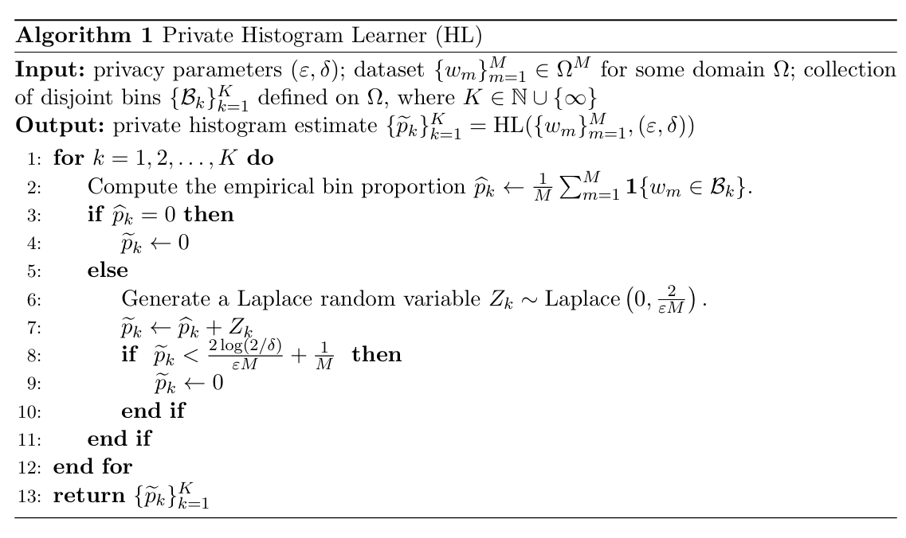
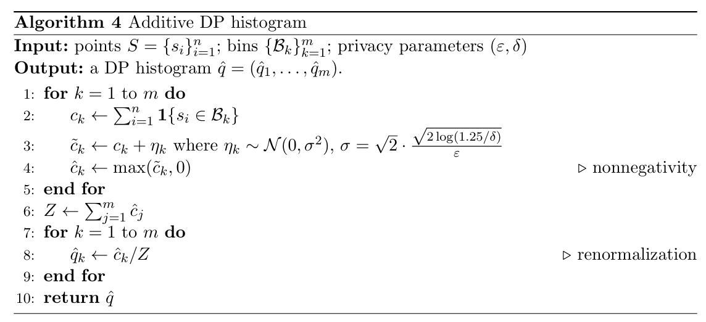
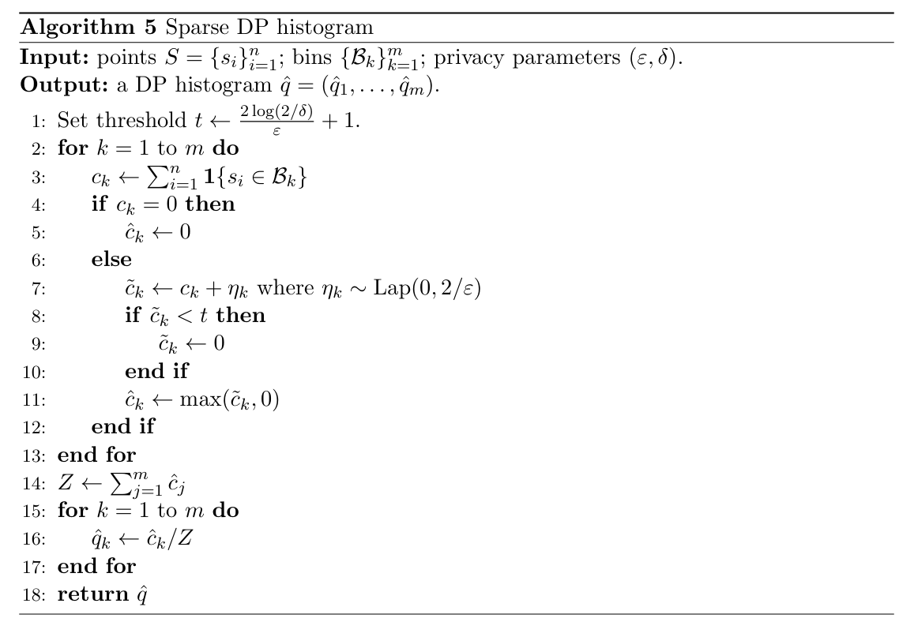

# Algorithms

This page collects the algorithms used in the `dppca` package. The
algorithms are included as images from the `figures/` folder.

## Algorithm 1: Private histogram learner

The private histogram learner is used as an auxiliary routine for
privately identifying the scale of a one-dimensional collection of
values. In our setting, it is used in the private scale-proxy step for
the Huber scree estimator, following the construction used by [Yu, Ren,
and Zhou (2024)](#ref-Yu2024).

Algorithm 1: Private histogram learner

## Algorithm 2: Private and robust estimator for $`m_2`$

This algorithm privately estimates the second-moment scale $`m_2`$,
which is needed to choose the Huber robustification parameter $`\tau`$.
It uses pairwise squared distances, block medians for robustness, and
the private histogram learner above to select a dyadic scale level.

Algorithm 2: Private and robust estimator for $`m_2`$

## Algorithm 3: Unbounded DP upper-quantile estimator

This algorithm is used in the PMWM scree estimator to estimate lower and
upper tail quantiles privately. It follows the unbounded private
quantile idea of [Durfee (2023)](#ref-Durfee2023), using a geometric
search grid and noisy comparisons against the empirical CDF.

Algorithm 3: Unbounded DP upper-quantile estimator

## Algorithm 4: Additive DP histogram

The additive DP histogram adds independent Gaussian noise to each bin
count and then post-processes the noisy counts to make them nonnegative
and normalized. This is the basic DP histogram mechanism used for score
histogram visualization.

Algorithm 4: Additive DP histogram

## Algorithm 5: Sparse DP histogram

When the grid is fine, many bins may be empty, and additive noise can
dominate the visualization. The sparse histogram keeps only stable bins
whose noisy counts are above a threshold, following the count-based
sparse histogram idea of [Karwa and Vadhan (2018)](#ref-Karwa2018).

Algorithm 5: Sparse DP histogram

## Algorithm 6: Group-wise additive DP histogram

The group-wise additive histogram applies the additive DP histogram
procedure separately to each group, using a common frame and grid. It is
useful for comparing PCA score distributions across groups.

Algorithm 6: Group-wise additive DP histogram

## Algorithm 7: Group-wise sparse DP histogram

The group-wise sparse histogram applies sparse thresholding separately
within each group and bin. It provides a private group-wise score
histogram while suppressing bins that are not reliably distinguishable
from zero.

Algorithm 7: Group-wise sparse DP histogram

## References

Durfee, D. (2023). Unbounded differentially private quantile and maximum
estimation. In *Advances in Neural Information Processing Systems*, 36,
77691–77712.

Vishesh Karwa and Salil Vadhan. (2018). “Finite sample differentially
private confidence intervals”. In *Proceedings of ITCS 2018*, LIPIcs,
94, 44:1–44:9. <https://doi.org/10.4230/LIPIcs.ITCS.2018.44>

Wasserman, L. and Zhou, S. (2010). A statistical framework for
differential privacy. *Journal of the American Statistical Association*,
105(489), 375–389. <https://doi.org/10.1198/jasa.2009.tm08651>

Yu, M., Ren, Z., and Zhou, W.-X. (2024). Gaussian differentially private
robust mean estimation and inference. *Bernoulli*, 30(4), 3059–3088.
<https://doi.org/10.3150/23-BEJ1706>
